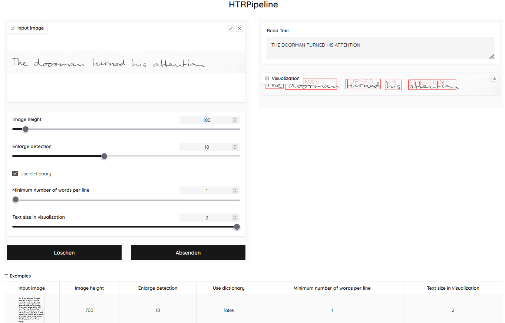
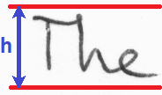
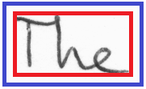

# Detect and Read Handwritten Words

This is a **handwritten text recognition (HTR) pipeline** that operates on **scanned pages** and applies the following
operations:

* Detect words
* Read words


## Installation

* Download the zipped [model weights](https://www.dropbox.com/s/j1hl6bppecug0sz/models.zip?dl=0)
* Unzip
* Copy the files (reader.onnx, reader.json, detector.onnx) into the folder `htr_pipeline/models`
* Go to the root level of the repository (where `setup.py` is located)
* Execute `pip install .`

## Usage

### Run demo

* Additionally install matplotlib for plotting: `pip install matplotlib`
* Go to `scripts/`
* Run `python demo.py`
* The output should look like the plot shown above

### Run web demo (gradio)

* Additionally install gradio: `pip install gradio`
* Go to the root directory of the repository
* Run `python scripts/gradio_demo.py`
* Open the URL shown in the output



### Use Python package

Import the function `read_page` to detect and read text.

````python
import cv2
from htr_pipeline import read_page, DetectorConfig, LineClusteringConfig

# read image
img = cv2.imread('data/sample_1.png', cv2.IMREAD_GRAYSCALE)

# detect and read text
read_lines = read_page(img, 
                       DetectorConfig(scale=0.4, margin=5), 
                       line_clustering_config=LineClusteringConfig(min_words_per_line=2))

# output text
for read_line in read_lines:
    print(' '.join(read_word.text for read_word in read_line))
````

## Selection of parameters

Configuration is done by passing instances of these dataclasses to the `read_page` function:
* `DetectorConfig`: configure the word detector
* `LineClusteringConfig`: configure the line clustering algorithm
* `ReaderConfig`: configure the text reader

The most important parameter for the detector is the scale.
The detector works best for text of height 50px. 
Setting a scale != 1 automatically resizes the image before applying te detector.
Example: Text height h is 100px in the original image. Set the scale to 0.5 so that detection happens at the ideal text size.



The second most important parameter for the detector is the margin. 
It allows adding a few pixels (blue) around the detected words (red) which might improve reading quality.



For the line clustering algorithm the minimum number of words can be set with the parameter `min_words_per_line`.
Lines which contain fewer words will be ignored.
Example: it is known that all lines contain 2 or more words. Then set the parameter to 2 to ignore false positive detections that form lines with only a single word.

## Future work
* Better documentation of all the features (e.g., how to use a dictionary) - for now please have a look into the demo scripts to learn about the features of this package
* Add special characters like ".", "?", ...
* Optionally, read the whole line instead of single words
* Improve inference speed