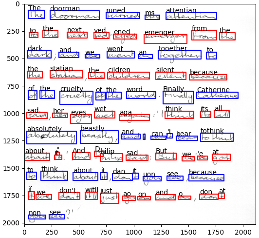

# Detect and Read Handwritten Words

This is a **handwritten text recognition (HTR) pipeline** that operates on **scanned pages** and applies the following
operations:

* Detect words
* Read words



The pipeline combines these two models:

* [Scale space based word detector](https://github.com/githubharald/WordDetector)
* [CRNN based text reader](https://github.com/githubharald/SimpleHTR)

**Don't expect too much as these are both very rudimentary models.**

## Installation

* Go to the root level of the repository
* Execute `pip install .`

## Usage

### Run demo

* Additionally install matplotlib for plotting: `pip install matplotlib`
* Go to `scripts/`
* Run `python demo.py`
* The output should look like the plot shown above

### Use Python package

Import the function `read_page` to detect and read text.

````python
import cv2
from htr_pipeline import read_page, DetectorConfig

# read image
img = cv2.imread('data/r06-137.png', cv2.IMREAD_GRAYSCALE)

# detect and read text
read_lines = read_page(img, DetectorConfig(height=1000))

# output text
for read_line in read_lines:
    print(' '.join(read_word.text for read_word in read_line))
````

If needed, the detection can be configured by instantiating and passing these data-classes:

* `DetectorConfig`
* `LineClusteringConfig`

For more details please have a look at the docstrings of `detect` and `sort_multiline`
in `htr_pipeline/word_detector/__init__.py`. The most important settings are:

* `height` in `DetectorConfig`: the word detector is not scale invariant, the text height should be 25-50px when using
  the default parameters, which is achieved by resizing the image to the specified height
* `min_words_per_line` in `LineClusteringConfig`: lines which have fewer words than specified are discarded, the default
  setting is 2, which means that lines with a single word will not be read by default